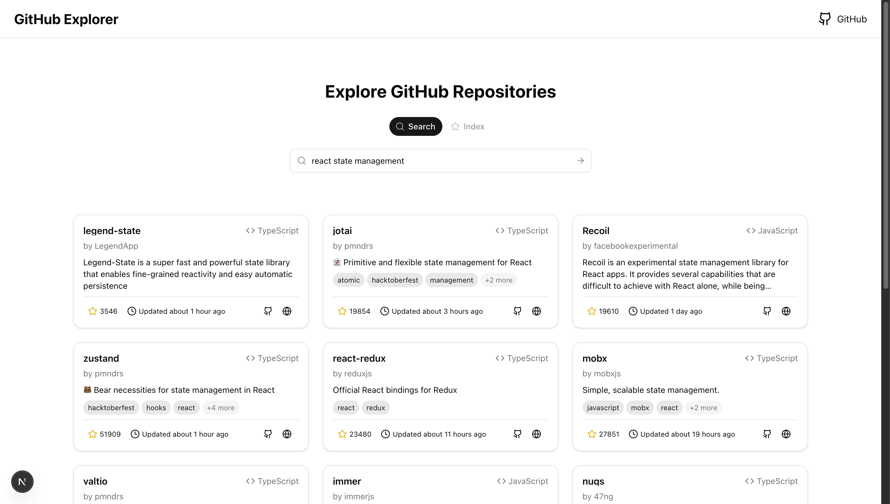

## GitHub Explorer



A simple web app for semantic search of GitHub repositories

## How It Works

1. Enter a GitHub username
2. Fetch repositories starred by the user
3. Summarize repositories with LLM
4. Index repositories in Vector DB
5. Use reranker to rerank results
6. Show search results

## TODO

- Auto crawling of repositories
- Search query rephrasing/suggestion

## Development

```bash
cp .env.example .env # Then fill in .env

pnpm install
pnpm dev
```

## Tech Stack

- Web framework: Next.js
- UI: Shadcn, Origin UI, Tailwind CSS
- Query: TanStack Query
- Vector DB: Upstash
- Reranking: Jina Reranker
- LLM: OpenRouter
